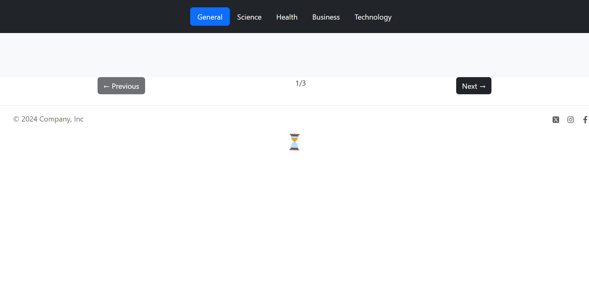
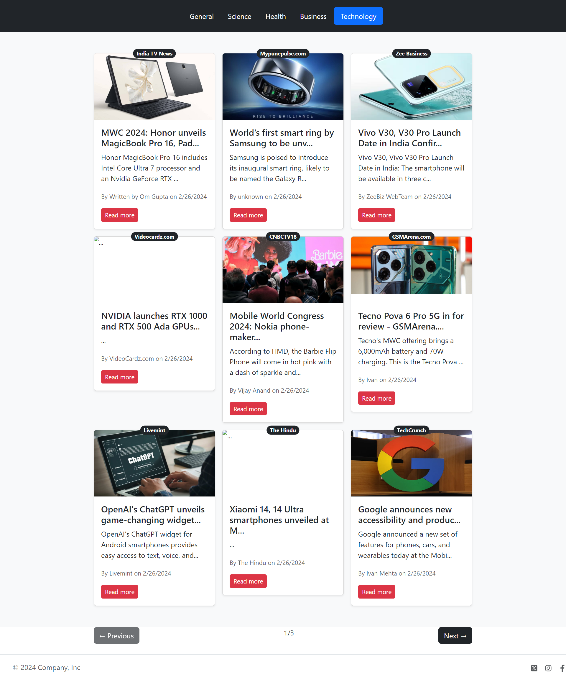
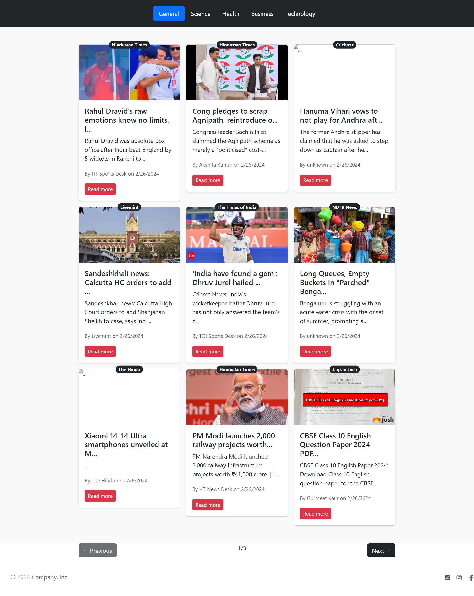

# News app

This a modern and intuitive News app created using React.js. Stay updated with the latest news from around the world with just a few clicks. Powered by a robust API backend, this app provides real-time news updates in various categories, including technology,general,business, and more. Seamlessly navigate through headlines, read full articles, and share interesting stories with friends and family. Whether you're a news enthusiast or just looking to stay informed, this app is your go-to source for all the latest news.

## Features

- **Real-time Updates**: Get the latest news updates from various sources in real-time.

- **Read Full Articles**: View complete news articles directly within the app.
- **Share Articles**: Share interesting news stories with friends and family via social media platforms.

## Technologies Used

- React.js
- React Router
- JavaScript
- HTML
- CSS
- Fetch API
- React Hooks (e.g., useContext,useReducer, useEffect)
- Bootstrap

## Screenshots

